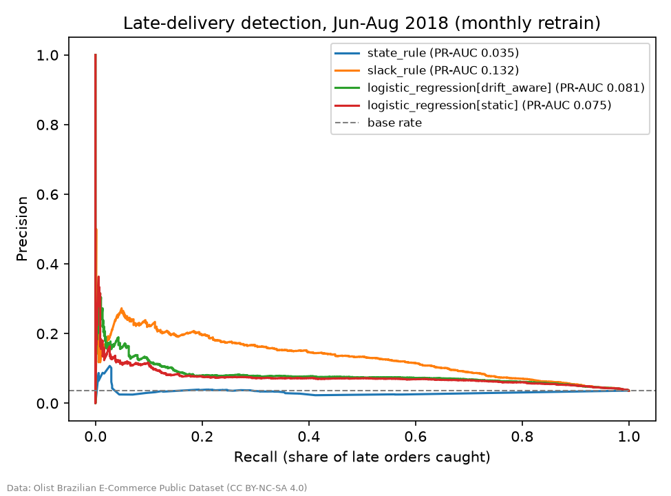

# E-commerce Order Analytics

Predicting and explaining **failed and late e-commerce orders** across three markets, with an
emphasis on what makes a model trustworthy in production: no data leakage, time-aware
evaluation, honest baselines, and drift monitoring.

| Market | Data | Question | Status |
|---|---|---|---|
| 🇩🇿 Algeria | Private merchant data from [Bizz](#data-and-privacy), a cash-on-delivery SaaS; the public repo runs on synthetic data with the same schema | Which orders will be refused or returned? | Pipeline + audit method; real results stay private |
| 🇧🇷 Brazil | [Olist](https://www.kaggle.com/datasets/olistbr/brazilian-ecommerce) public dataset (96k delivered orders) | Will this order arrive after its promised date? | Full modeling + walk-forward evaluation |
| 🇫🇷 France | Synthetic B2C fashion orders, calibrated on public French figures | Returns and uncollected parcels | Market module + Power BI demo |

## Key findings

**1. On Olist, a one-line adaptive rule beats machine learning, because of concept drift.**
Around May 2018 the late-delivery rate fell from 7.6 % to 3.5 % and the signals flipped (far orders
went from riskier to safer). I built `promise_slack` = promised days − the average transit time on the
same route over the last 60 days of *completed* deliveries. Under a monthly walk-forward retrain:

| Method | ROC-AUC | PR-AUC | Late orders caught by reviewing 20 % |
|---|---|---|---|
| **Slack rule** | **0.72** | **0.103** | **50 %** |
| Logistic regression (drift-aware) | 0.68 | 0.073 | 40 % |
| Gradient boosting (best variant) | 0.62 | 0.070 | 36 % |
| Base rate | 0.50 | 0.036 | ~20 % |

Models learn *how much* each signal mattered in the old regime; the rule only uses a ranking that
stays true. Mean over Jun–Aug 2018; details in `reports/olist/metrics.json`.



**2. The drift monitor catches that break on its own.** `monitoring.py` (PSI per feature + a
two-proportion z-test on the outcome) flags `route_recent_transit` (PSI 1.55), `promised_days` (0.37)
and a significant outcome shift (z = −28) between Jan–Apr and Jun–Aug 2018, and recommends
retraining with a fallback to the rule. On small windows it answers "not enough data" instead of
raising false alarms.

**3. On real cash-on-delivery data, the first job is to question the label.** Run on a private
merchant's orders (results not published), the audit method surfaced things a model would have learned blindly:
- **Data-quality bugs in the source app**: imported carrier orders carried the import time instead of the
  order date (a wrong API field name), and unknown purchase costs were stored as 0. Both were fixed upstream.
- **"Failed" is not always a lost sale.** A return quickly followed by a new order from the same client is
  most likely an exchange. `analysis_dz.py` flags these as *likely swaps* (hindsight, never a feature), and
  several apparent effects reversed once they were separated from real failures.
- **Recording effects**: statuses synced by the carrier and statuses typed by hand behave differently, so
  every comparison is also run within one entry channel, with a significance test next to each claim.

## Method

- **Leak-free features.** Client, seller and route histories only count outcomes known *before* the
  order's day ([`rolling.py`](src/order_analytics/rolling.py)); tests enforce it.
- **Time-aware evaluation.** Walk-forward: retrain on the 1st of each month on orders whose outcome
  was already known (promised date passed), score that month.
- **Baselines first.** Every model is compared with the base rate and simple rules (the app's
  existing trust rule, a per-state rule, the slack rule).
- **Metrics that fit rare events:** PR-AUC and recall at a review budget, not accuracy.
- **Market modules:** local time (Algiers UTC+1; Paris with DST), weekends (Fri–Sat vs Sat–Sun),
  Ramadan/Eid, French holidays, soldes and Black Friday, wilayas → regions, départements → regions.

## Project layout

```
src/order_analytics/
  sources/          bizz.py (read-only, pseudonymized extraction) · olist.py (pinned zip)
  markets/          dz.py · fr.py
  features.py       Bizz features (client history, route failure rate, calendar)
  train.py          Bizz time-split evaluation vs the app's trust rule
  analysis_dz.py    Algerian findings, each with a significance test (results stay local)
  olist_late.py     late-delivery modeling + walk-forward
  monitoring.py     PSI / outcome-shift drift reports
  synthetic.py      synthetic Bizz-shaped data · synthetic_fr.py (calibrated FR data)
  export_powerbi.py star schema (CSV) for Power BI
powerbi/            DAX measures + validated colour theme
tests/              46 tests (leakage, calendars, calibration, drift, analysis)
```

## Run it

```bash
uv sync
uv run pytest
uv run python -m order_analytics.sources.olist        # needs the Olist zip in data/raw/public/
uv run python -m order_analytics.olist_late           # walk-forward evaluation (~20 s)
uv run python -m order_analytics.monitoring olist     # drift report
uv run python -m order_analytics.synthetic_fr         # French synthetic orders
uv run python -m order_analytics.export_powerbi       # CSVs for Power BI
uv run python -m order_analytics.features             # features on synthetic Bizz-shaped data (`real` = private data)
uv run python -m order_analytics.analysis_dz          # Algerian analysis on those features (output stays local)
```

## Data and privacy

- **Bizz** orders are extracted read-only; names, phones, addresses and notes are never selected, and
  client/shop IDs are HMAC-pseudonymized with a secret salt. That data never leaves the machine: no rows,
  no counts and no results computed on it are in this repository (`data/` and its reports are gitignored).
- **Olist**: Olist Brazilian E-Commerce Public Dataset, **CC BY-NC-SA 4.0**. The data is not
  redistributed here; derived results are shared with attribution for non-commercial use.
- **France**: synthetic. Calibrated on FEVAD's 2025 e-commerce report (average basket €62) and published
  clothing return rates (18–23 %); every unsourced parameter is marked `ASSUMPTION` in the code.

## Limitations

- The private Algerian sample is too small to validate a model; the pipeline is ready to retrain as orders
  accumulate, and the monitor says when the data is sufficient.
- Olist covers 2016–2018, before COVID-era changes in e-commerce. The results show a *method* for
  shifting conditions, not today's Brazilian behaviour.
- French results describe the generator, not the French market.
